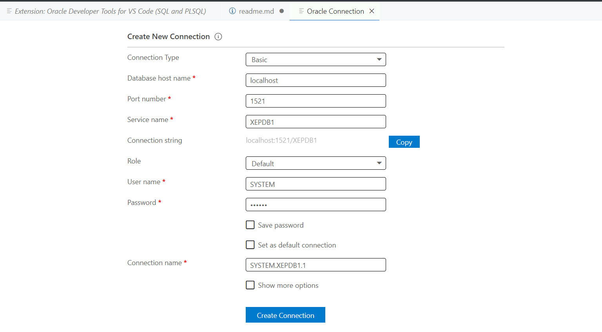

### To launch Oracle Database inside Docker container:
* `docker pull gvenzl/oracle-xe`
* `docker run -d -p 1521:1521 -e ORACLE_PASSWORD=<your password> gvenzl/oracle-xe`
* In, for example, DataGrip connect to DB with username SYSTEM, passsword <your password> `// Seems that I used SYSTEM also for password in my program`
* In Microsoft Visual Studio Code download extension `Oracle Developer Tools for VS Code (SQL and PLSQL)` and insert following credentials to connect (in my case it all was already inserted initially automatically): 

