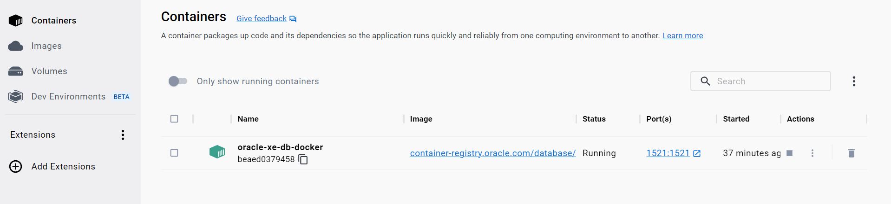

### _To launch Oracle Database inside Docker container:_  
* _Go to https://container-registry.oracle.com/_
* _Pull the last Oracle Database Express Edition image `docker pull container-registry.oracle.com/database/express:latest`_
* `docker run -e ORACLE_PWD="<any password>" --name <any image> -d -p 1521:1521 container-registry.oracle.com/database/express`
    * _For example, my command looked like `docker run -e ORACLE_PWD="SYSTEM" --name oracle-xe-db-docker -d -p 1521:1521 container-registry.oracle.com/database/express`_
* _In Microsoft Visual Studio Code download extension `Oracle Developer Tools for VS Code (SQL and PLSQL)` and insert following credentials to connect (in my case it all was already inserted initially automatically):_ 

* _And next time before connection don't forget to run container (for example, you can do this via UI client Docker Desktop):_
  