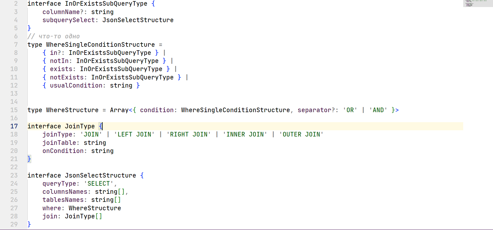
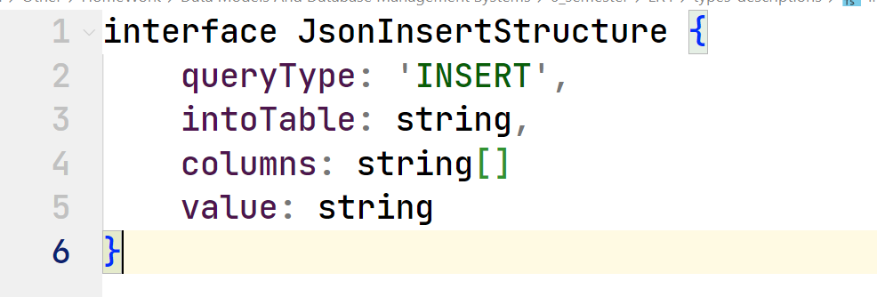
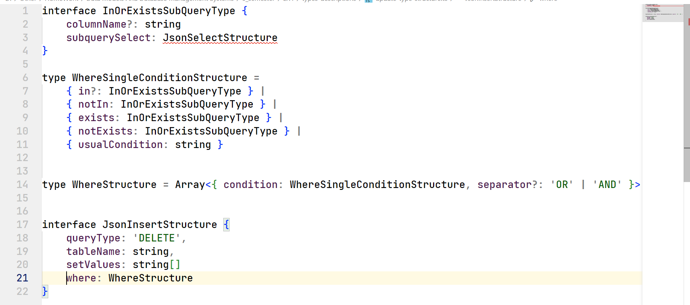
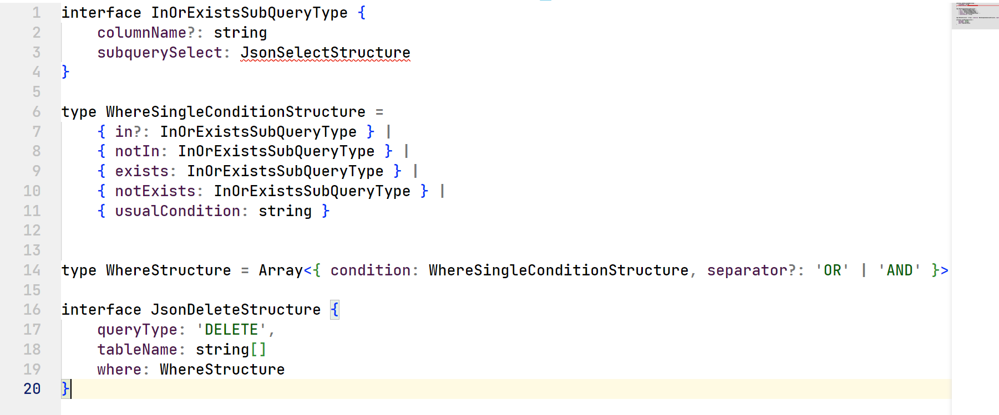

## _Laboratory work 4_
___   
### To test:  
_There is a `file` [./examples_to_test.json](examples_to_test.json) with queries examples. When launching this DB first, go to that file, copy queries from JSON array one by one to `main` and execute it (one query object ==> one execution). Don't forget to change some lines in main when you will need to get SELECT output_
___
### _My types structure:_  

#### _SELECT_  
  

#### _INSERT_  
  

#### _UPDATE_  
  

#### _DELETE_  
  

___
###### Copyright © 2023 April